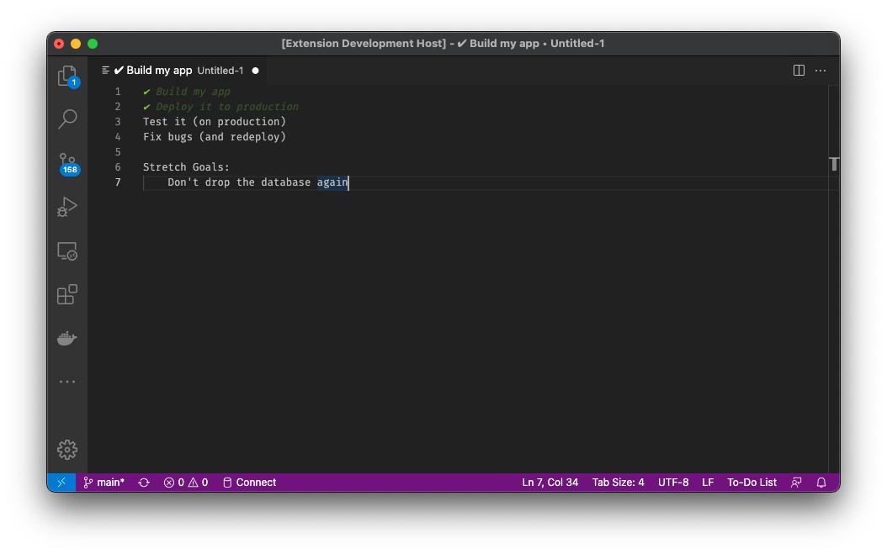

# Basic To-Do Lists

Adds support for a new file / language type, `.todolist`, which allows you to make extremely simple plain-text to-do lists.

Using the "comment out" keyboard shortcut, you can toggle whether an item is crossed off. All this does is add a checkmark character ✔ at the start of the current line. Any lines starting with this character are green, italisied, and dimmed out to show that they are completed.

